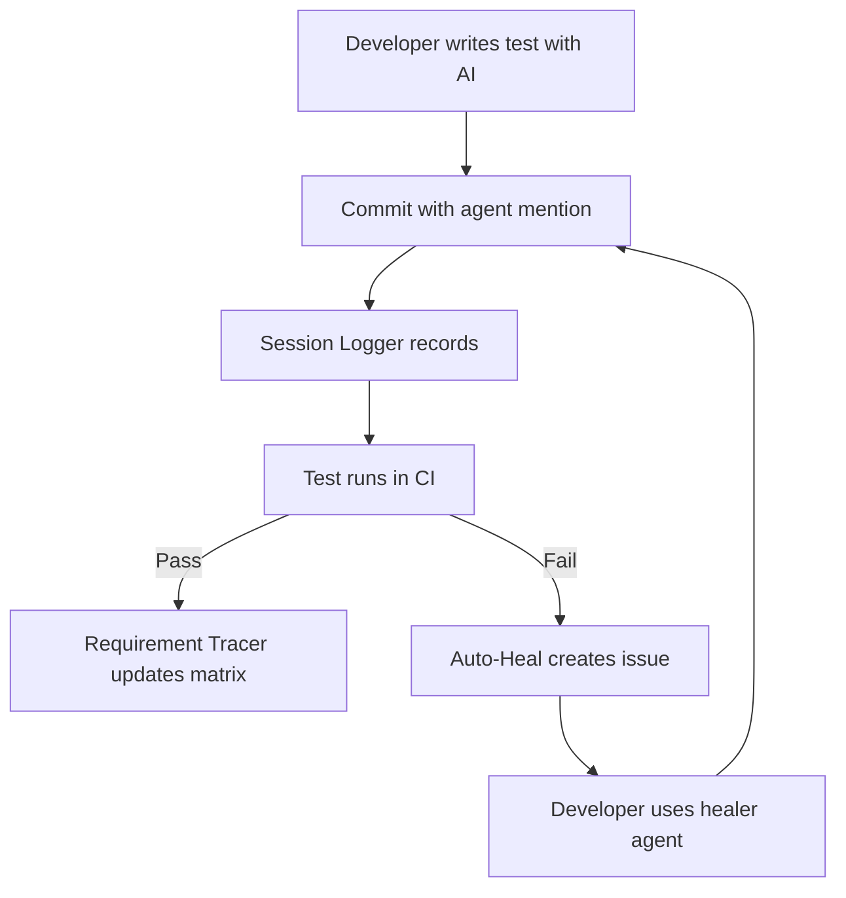

# GitHub Configuration & AI Resources

This directory contains AI agents, prompts, and configuration that power the **AI-Assisted Testing Infrastructure** for this Cypress/Playwright repository.

## 🤖 AI Orchestrator

The **QA Orchestrator** (`@qa-orchestrator`) is the central AI controller that analyzes your testing needs, infers unstated requirements, and delegates work to specialized personas.

### Key Features
- 🧠 **Requirement Inference**: Automatically identifies accessibility, security, and performance needs
- 🎯 **Smart Delegation**: Routes tasks to the right QA persona
- 💰 **Cost-Optimized**: Uses premium models (1X) for strategy, low-cost models (0X) for execution
- 📊 **Requirement Traceability**: Links tests to requirements and acceptance criteria

### How to Use

**Invoke the Orchestrator**:
```
@qa-orchestrator create comprehensive tests for the login feature
@qa-orchestrator fix the failing checkout test
@qa-orchestrator migrate cypress tests to playwright
```

The orchestrator will:
1. Analyze your request (stated + unstated requirements)
2. Select appropriate personas (QA Engineer, SDET, etc.)
3. Coordinate the work
4. Ensure quality standards are met

---

## 🎭 QA Personas

All personas use **low-cost models (0X tier)** for efficient execution:

| Persona | Focus | When to Use |
|---------|-------|-------------|
| **[@qa-engineer](./agents/qa-roles/qa-engineer.md)** | Functional testing, bug detection | Test case review, exploratory testing |
| **[@qa-architect](./agents/qa-roles/qa-architect.md)** | Framework design, CI/CD | Test architecture, infrastructure planning |
| **[@manual-tester](./agents/qa-roles/manual-tester.md)** | Exploratory testing, usability | Manual test cases, edge case discovery |
| **[@automation-engineer](./agents/qa-roles/automation-engineer.md)** | Test automation, POM | Writing automated tests, page objects |
| **[@sdet](./agents/qa-roles/sdet.md)** | Advanced frameworks, API/performance testing | Custom tools, performance tests |

### Framework-Specific Agents

**Cypress** (10.x - 13.x):
- **[@cypress-healer](./agents/cypress/cypress-healer.md)**: Fix broken Cypress tests
- **[@cypress-to-playwright-migration](./agents/cypress/cypress-to-playwright-migration.md)**: Migrate to Playwright

**Playwright** (1.38 - 1.48+):
- **[@playwright-healer](./agents/playwright/playwright-healer.md)**: Fix broken Playwright tests  
- **[@playwright-test-generator](./agents/playwright/playwright-test-generator.md)**: Generate new tests
- **[@playwright-test-planner](./agents/playwright/playwright-test-planner.md)**: Plan test strategy

---

## ⚡ Slash Commands (GitHub Copilot Chat)

Quick commands for VS Code GitHub Copilot Chat:

### Cypress Commands
- `/cypress-create [feature]` - Generate Cypress tests
- `/cypress-heal [test file]` - Fix broken Cypress tests

### Playwright Commands
- `/playwright-create [feature]` - Generate Playwright tests
- `/playwright-heal [test file]` - Fix broken Playwright tests

### Migration Commands
- `/migrate-cy-to-pw [file]` - Migrate Cypress to Playwright

### Example Usage
```
/playwright-create login page with email and password
/cypress-heal cypress/e2e/checkout.cy.ts
/migrate-cy-to-pw cypress/e2e/auth.cy.ts
```

---

## 💰 Model Pricing & Strategy

### Orchestrator (Premium - 1X Tier)
- **Model**: GPT-4 or equivalent premium model
- **Use Case**: Strategic decisions, requirement analysis, delegation
- **Fallback**: GPT-3.5-turbo (0X) on rate limits

### Personas (Low-Cost - 0X Tier)
- **Model**: GPT-3.5-turbo or equivalent
- **Use Case**: Task execution, test generation, code fixes
- **Cost**: Free or minimal cost per request

See [model-config.json](./agents/qa-orchestrator/model-config.json) for full configuration.

---

## 📚 Documentation & Templates

### Test Structure Templates
- **[BDD Template](./templates/bdd-template.md)**: Given-When-Then format
- **[AAA Template](./templates/aaa-template.md)**: Arrange-Act-Assert format
- **[Requirements Traceability](./templates/requirements-traceability.md)**: Link tests to requirements

### Prompts Directory
```
prompts/
├── cypress/              # Cypress-specific prompts
│   ├── cypress-test-creation.prompt.md
│   └── cypress-test-healing.prompt.md
├── playwright/           # Playwright-specific prompts
│   ├── playwright-test-creation.prompt.md
│   └── playwright-test-healing.prompt.md
└── migration/            # Migration prompts
    └── migrate-cypress-to-playwright.prompt.md
```

---

## 🚀 Quick Start Guide for Beginners

### Step 1: Understanding the System

This repository uses AI agents to help you with testing. Think of it as having a team of QA experts available 24/7:
- **Orchestrator**: The team lead who assigns work
- **Personas**: Specialists (engineer, architect, tester, etc.)

### Step 2: Using in VS Code

1. **Open GitHub Copilot Chat** (Ctrl+Shift+I or Cmd+Shift+I on Mac)
2. **Invoke the Orchestrator**:
   ```
   @qa-orchestrator I need tests for the login page
   ```
3. **Or Use Slash Commands**:
   ```
   /playwright-create login functionality
   ```

### Step 3: What the AI Will Do

The AI will:
1. **Ask clarifying questions** (if needed)
2. **Analyze requirements** (stated + unstated)
3. **Generate tests** with:
   - Functional tests (happy path + errors)
   - Accessibility tests (keyboard nav, ARIA)
   - Security tests (XSS prevention, validation)
   - Performance tests (load times)

### Step 4: Review the Output

The AI will create:
- Test files (`*.spec.ts` or `*.cy.ts`)
- Page Objects (`*Page.ts`)
- Fixtures (if needed)

**Always review the generated code** before committing!

### Step 5: Run the Tests

```bash
# Playwright
npx playwright test

# Cypress
npm run cy:run
```

---

## 🔧 Troubleshooting

### "Agent not found"
Make sure you're using the correct agent name with `@` prefix:
```
@qa-orchestrator (not qa-orchestrator)
@cypress-healer (not cypress healer)
```

### "Slash command not recognized"
Slash commands only work in GitHub Copilot Chat (VS Code). Make sure Copilot is enabled.

### "Tests still failing after healing"
1. Check the error logs carefully
2. Share the trace file or screenshot with the healer
3. Invoke: `/playwright-heal [test] --verbose` for detailed analysis

### "How do I know which agent to use?"
Use `@qa-orchestrator` and let it decide! It will analyze your request and delegate to the right persona.

---

## 🧠 Memory & Automated Workflows

👉 **Dual Support**: All workflows available for both **GitHub Actions** and **Azure DevOps Pipelines**
- GitHub: `.github/workflows/`
- Azure: `.azure-pipelines/` ([Setup Guide](.../.azure-pipelines/README.md))

### Session Logging

All AI interactions can be tracked in [`.github/memory/session-log.md`](./memory/session-log.md):
- **What**: Logs agent usage, decisions made, files modified
- **When**: Automatically on test file changes (via `ai-session-logger.yml`)
- **Why**: Provides continuity across sessions and requirement traceability

**Manual Logging**: Add entries using the template in `session-log.md`

### Automated Workflows

#### 1. **AI Session Logger** ([`ai-session-logger.yml`](./workflows/ai-session-logger.yml))
- **Triggers**: When test files (`.spec.ts`, `.cy.ts`) are modified
- **Action**: Logs agent used, files changed, commit message to `session-log.md`
- **Usage**: Commit with agent mention: `git commit -m "@playwright-healer fixed checkout test"`

#### 2. **Auto-Heal Failing Tests** ([`auto-heal-tests.yml`](./workflows/auto-heal-tests.yml))
- **Triggers**: When CI fails or manual dispatch
- **Action**: Creates GitHub issue with:
  - Failed test file names
  - Recommended healer agent to use
  - Links to trace files/screenshots
  - Copy-paste commands for Copilot Chat
- **Usage**: Issue provides instructions like:
  ```
  @playwright-healer analyze trace at test-output/playwright-output/trace.zip
  ```

#### 3. **Requirement Tracer** ([`requirement-tracer.yml`](./workflows/requirement-tracer.yml))
- **Triggers**: When test files are modified
- **Action**: Extracts `@feature`, `@acceptance-criteria` from test comments
- **Output**: Generates `traceability-matrix.md` linking requirements → tests
- **PR Comments**: Posts coverage report on pull requests

### How They Work Together



### Example Workflow

1. **Generate Test**: `@qa-orchestrator create tests for checkout`
2. **Commit**: `git commit -m "@automation-engineer added checkout tests"`
3. **Session Logged**: Workflow records agent usage in `session-log.md`
4. **CI Runs**: Test executes
5. **If Fails**: Auto-heal workflow creates issue with healing instructions
6. **Requirement Traced**: Traceability matrix updated with test coverage

---

## 📁 Directory Structure

```
.github/
├── agents/
│   ├── qa-orchestrator/          # Central orchestrator
│   │   ├── main-orchestrator.md
│   │   └── model-config.json
│   ├── cypress/                   # Cypress agents
│   │   ├── cypress-healer.md
│   │   └── cypress-to-playwright-migration.md
│   ├── playwright/                # Playwright agents
│   │   ├── playwright-healer.md
│   │   ├── playwright-test-generator.md
│   │   └── playwright-test-planner.md
│   └── qa-roles/                  # QA personas
│       ├── qa-engineer.md
│       ├── qa-architect.md
│       ├── manual-tester.md
│       ├── automation-engineer.md
│       └── sdet.md
├── prompts/                       # Slash command prompts
│   ├── cypress/
│   ├── playwright/
│   └── migration/
├── templates/                     # Test templates
│   ├── bdd-template.md
│   ├── aaa-template.md
│   └── requirements-traceability.md
├── copilot-instructions.md        # Core migration rules
└── README.md                      # This file
```

---

## 🎯 Best Practices

1. **Start with the Orchestrator**: Use `@qa-orchestrator` for complex tasks
2. **Use Slash Commands**: For quick, specific actions (`/playwright-create`)
3. **Review Generated Code**: Always read and understand before committing
4. **Link to Requirements**: Use the traceability template
5. **Follow Templates**: Use BDD or AAA structure consistently

---

## 📖 Further Reading

- [Main README](../README.md) - Project overview
- [Copilot Instructions](./copilot-instructions.md) - Detailed migration rules
- [Migration Guide](../docs/MIGRATION_GUIDE.md) - Cypress → Playwright guide

---

**Need Help?** Invoke `@qa-orchestrator what can you help me with?` in GitHub Copilot Chat.

