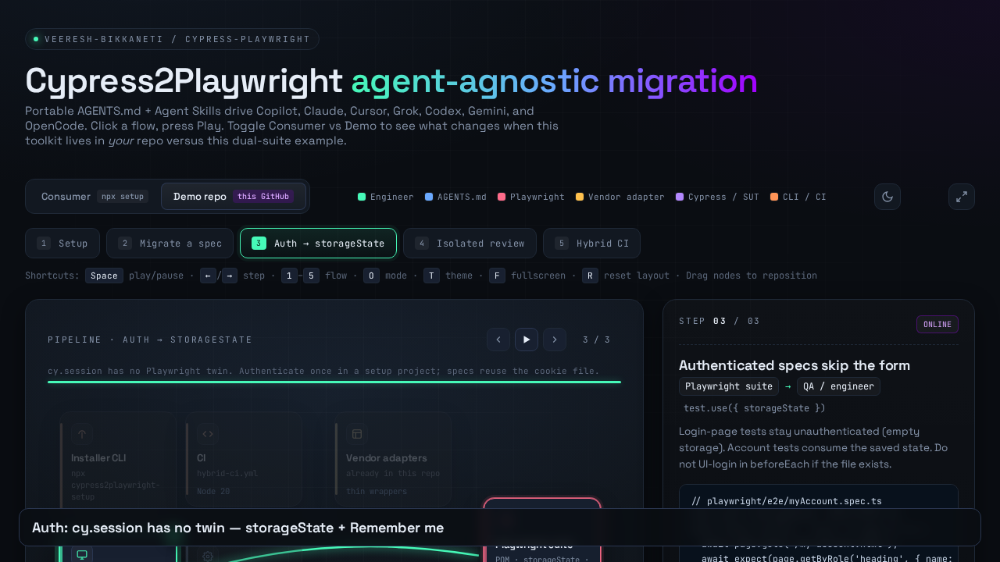
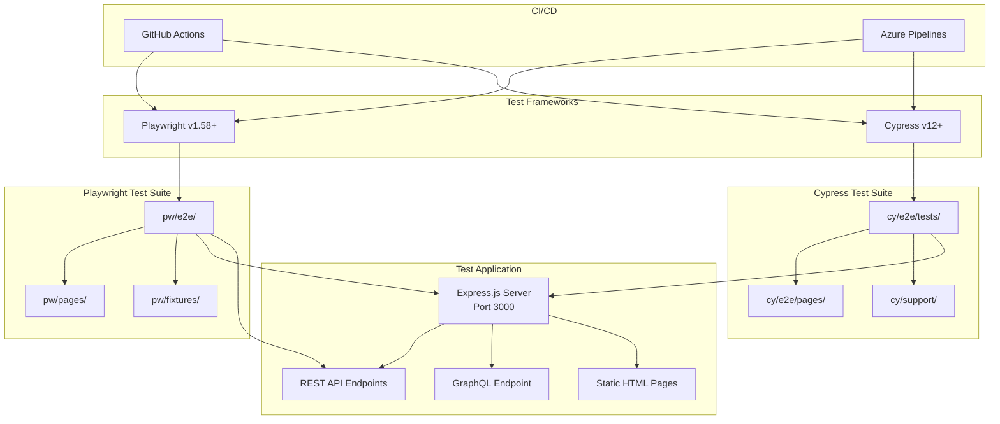
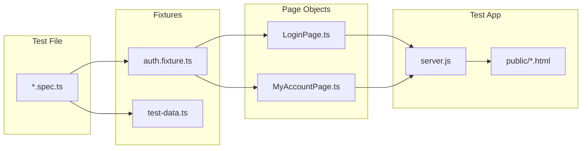
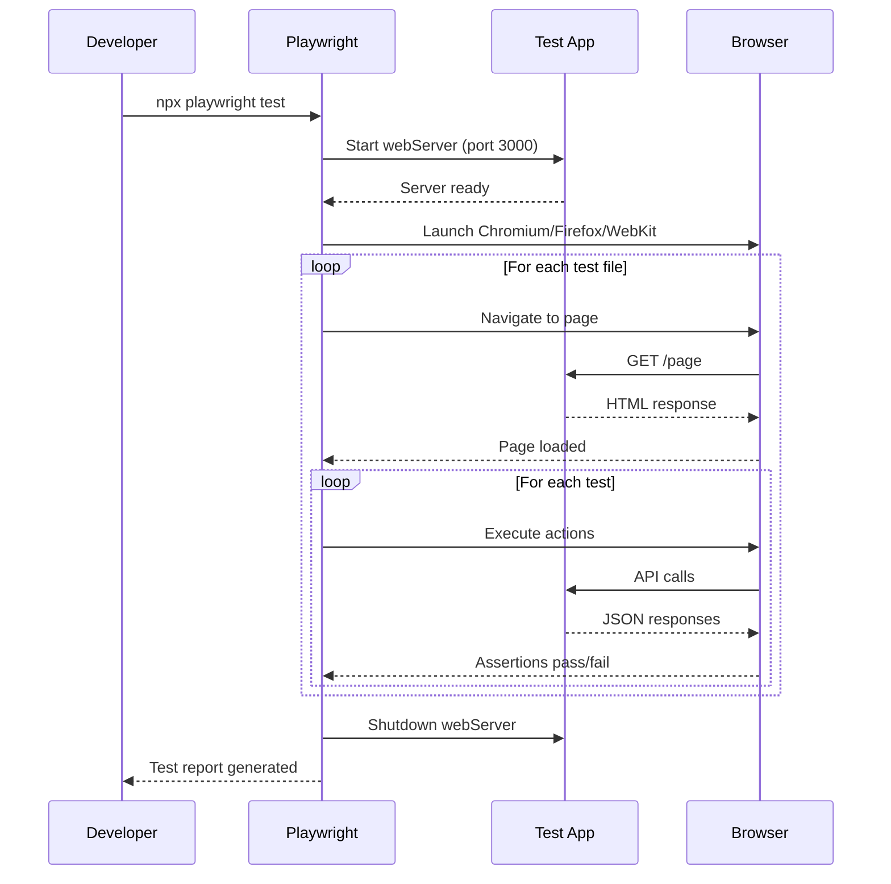
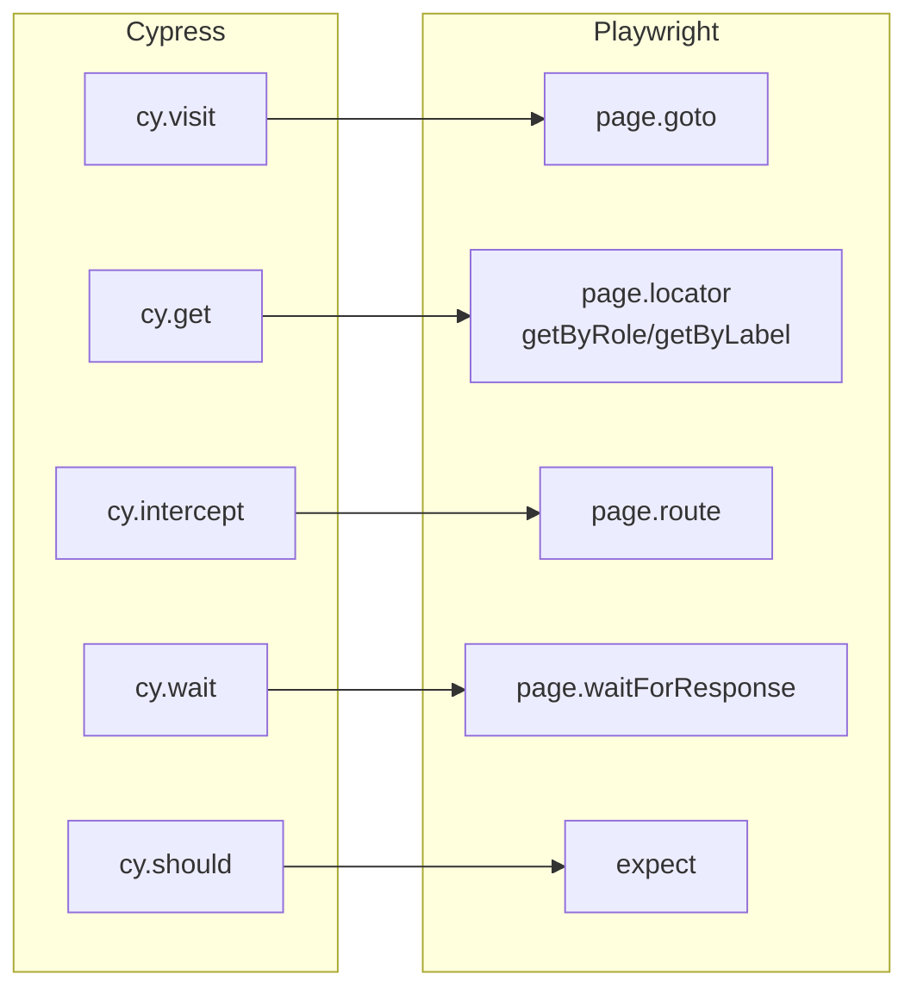

# Cypress ↔ Playwright Hybrid Testing Framework

> Cypress-to-Playwright migration toolkit. Portable `AGENTS.md` + Agent Skills for **GitHub Copilot, Claude Code, Cursor, Grok, OpenAI Codex, Gemini, and OpenCode** — plus a dual-framework demo suite.

[](https://playwright.dev)
[](https://cypress.io)
[](https://nodejs.org)
[](https://www.typescriptlang.org)

**Docs:** [docs/README.md](./docs/README.md) · **Setup:** [docs/SETUP.md](./docs/SETUP.md) · **Inventory:** [docs/INVENTORY.md](./docs/INVENTORY.md) · **Workflows:** [docs/WORKFLOW.md](./docs/WORKFLOW.md) · **Interactive architecture:** [docs/architecture.html](./docs/architecture.html) · **Demo video:** [docs/demo/setup-and-use.mp4](./docs/demo/setup-and-use.mp4)

[](./docs/demo/setup-and-use.mp4)

Merge feature PRs with a **merge commit**. Do not squash the enterprise-agent history — [why](./CONTRIBUTING.md).

---

## Enterprise AI agents

The migration procedure is **agent-agnostic**. Every supported tool reads the same two artifacts:

| Artifact | Role |
| --- | --- |
| [`AGENTS.md`](./AGENTS.md) | Always-on project contract (layout, locators, quality gates) |
| [`skills/`](./skills/) | On-demand playbooks ([Agent Skills](https://agentskills.io/specification) spec) |

Vendor files are thin adapters. They must not contradict `AGENTS.md`.

| Tool | Adapter | How you invoke |
| --- | --- | --- |
| **Any** | `AGENTS.md` + `skills/` | `migrate cypress/e2e/tests/login.test.ts` |
| **GitHub Copilot** | `.github/copilot-instructions.md`, `.github/agents/*.agent.md` | `@cypress-to-playwright-migration` |
| **Claude Code** | `CLAUDE.md`, `.claude/commands/` | `/migrate`, `/heal`, `/review` |
| **Cursor** | `.cursor/rules/*.mdc` | Auto on `playwright/**`, `cypress/**` |
| **Grok / Codex / OpenCode** | (core only) | Natural language |
| **Gemini** | `GEMINI.md` | Natural language |

Not targeted: Aider, Cline, Continue, Windsurf.

```bash
npx cypress2playwright-setup setup --tools copilot,claude,cursor
```

Details: [docs/ENTERPRISE_AGENTS.md](./docs/ENTERPRISE_AGENTS.md) · [plugin/README.md](./plugin/README.md) · [docs/AGENT_WORKFLOWS.md](./docs/AGENT_WORKFLOWS.md)

---

## Architecture



### Page Object Model Architecture



### Test Execution Flow



### Cypress vs Playwright Command Mapping



---

## Quick Start

```bash
# 1. Clone and install
git clone https://github.com/veeresh-bikkaneti/cypress-playwright.git
cd cypress-playwright
npm install

# 2. Install Playwright browsers
npx playwright install

# 3. Run Playwright tests (auto-starts server)
npx playwright test

# 4. View report
npx playwright show-report
```

---

## Project Structure

```
cypress-playwright/
├── AGENTS.md                    # Portable always-on agent contract
├── skills/                      # Agent Skills (4 consumer + architecture-diagram + skill-creator)
├── CLAUDE.md / GEMINI.md        # Thin vendor adapters
├── CONTRIBUTING.md              # Merge-commit policy (do not squash feat PRs)
├── app-under-test/              # Express.js test application
│   ├── server.js                #   API + static file server
│   └── public/                  #   HTML pages (login, dashboard, forms, dialogs)
│
├── playwright/                  # Playwright test suite (modern)
│   ├── e2e/                     #   Test specifications
│   ├── pages/                   #   Page Object Models
│   └── fixtures/                #   Test data & auth fixtures
│
├── cypress/                     # Cypress test suite (legacy source)
│   ├── e2e/tests/
│   ├── e2e/pages/
│   └── support/
│
├── plugin/                      # Installer: core + Copilot/Claude/Cursor/Gemini adapters
├── docs/                        # Setup, inventory, workflow diagrams, architecture.html, demo video
├── docs/ENTERPRISE_AGENTS.md    # Tool matrix vs live vendor docs
├── playwright.config.ts
├── cypress.config.ts
└── package.json
```

---

## Usage Guide

### Running Tests

| Command                                  | Description                           | Auto-Starts Server |
| ---------------------------------------- | ------------------------------------- | :----------------: |
| `npx playwright test`                    | Run all Playwright tests (3 browsers) |         ✅         |
| `npx playwright test --project=chromium` | Chromium only                         |         ✅         |
| `npx playwright test --headed`           | See browser actions                   |         ✅         |
| `npx playwright test --ui`               | Interactive UI mode                   |         ✅         |
| `npx playwright test --debug`            | Step-through debugging                |         ✅         |
| `npx playwright test auth/login`         | Specific test file                    |         ✅         |
| `npm run cy:run`                         | Run all Cypress tests                 |         ❌         |
| `npm run cy:open`                        | Open Cypress Test Runner              |         ❌         |
| `npm run test:hybrid`                    | Run both frameworks in parallel       |      Partial       |

### Playwright Advanced

```bash
# Run with trace recording
npx playwright test --trace on

# Run specific test by title
npx playwright test -g "login with valid"

# Run in different browsers
npx playwright test --project=firefox
npx playwright test --project=webkit

# Generate HTML report
npx playwright show-report test-output/playwright-output/report
```

### Cypress

```bash
# Start server first (separate terminal)
cd app-under-test && npm run dev

# Run specific spec
npx cypress run --spec "cypress/e2e/tests/login.test.ts"

# Run with Allure reporter
npm run cy:run

# Open interactive runner
npm run cy:open
```

### Code Quality

```bash
npm run lint          # ESLint check
npm run lint:fix      # Auto-fix lint issues
npm run type-check    # TypeScript compilation check
npm run validate      # Full validation (type-check + lint + format)
npm run format        # Prettier format
```

---

## Page Object Pattern

### LoginPage (Playwright)

```typescript
// playwright/pages/LoginPage.ts
import { Page, Locator, expect } from "@playwright/test";

export class LoginPage {
  readonly page: Page;
  readonly emailAddressTxt: Locator;
  readonly passwordTxt: Locator;
  readonly signinBtn: Locator;

  constructor(page: Page) {
    this.page = page;
    this.emailAddressTxt = page.getByLabel("Email Address");
    this.passwordTxt = page.getByLabel("Password");
    this.signinBtn = page.getByRole("button", { name: "Sign In" });
  }

  async login(email: string, password: string) {
    await this.page.goto("/login");
    await this.emailAddressTxt.fill(email);
    await this.passwordTxt.fill(password);
    await this.signinBtn.click();
  }

  async validateSuccessfulLogin() {
    await expect(this.page).toHaveURL(/.*\/dashboard/);
  }
}
```

### Auth via storageState (Playwright)

Login once in the setup project (`playwright/e2e/auth.setup.ts`). Authenticated specs reuse that file:

```typescript
import { test, expect } from "@playwright/test";
import { AUTH_STATE } from "../auth-state";
import { MyAccountPage } from "../pages/MyAccountPage";

test.describe("My Account", () => {
  test.use({ storageState: AUTH_STATE });

  test("dashboard when authenticated", async ({ page }) => {
    const account = new MyAccountPage(page);
    await page.goto("/dashboard");
    await account.validateSuccessfulLogin();
  });
});
```

Login specs stay logged out:

```typescript
test.use({ storageState: { cookies: [], origins: [] } });
```

Do not UI-login in `beforeEach`. Do not keep an unused `authenticatedPage` fixture.

### Login fixtures (optional)

`playwright/fixtures/auth.fixture.ts` only wraps Page Objects used by login specs (`loginPage`, `myAccountPage`).

---

## Migration Playbook

### Cypress → Playwright Cheat Sheet

| Cypress                                  | Playwright                                               |
| ---------------------------------------- | -------------------------------------------------------- |
| `cy.visit('/page')`                      | `await page.goto('/page')`                               |
| `cy.get('[data-testid="x"]')`            | `page.getByTestId('x')`                                  |
| `cy.contains('text')`                    | `page.getByText('text')`                                 |
| `cy.get('button').click()`               | `await page.getByRole('button').click()`                 |
| `cy.get('input').type('text')`           | `await page.getByLabel('Input').fill('text')`            |
| `cy.intercept('GET', '/api', {})`        | `await page.route('**/api', r => r.fulfill({json: {}}))` |
| `cy.wait('@alias')`                      | `await page.waitForResponse('**/api')`                   |
| `cy.get('.el').should('be.visible')`     | `await expect(page.locator('.el')).toBeVisible()`        |
| `cy.url().should('include', '/path')`    | `await expect(page).toHaveURL(/\/path/)`                 |
| `cy.get('.el').should('have.text', 'x')` | `await expect(page.locator('.el')).toHaveText('x')`      |

### Migration Steps

1. **Analyze** — Read the Cypress test, identify custom commands and dependencies
2. **Create Page Object** — Extract selectors and actions into a class
3. **Create Fixture** — Convert `beforeEach` setup into Playwright fixtures
4. **Migrate Test** — Convert `cy.*` calls to `await page.*` with semantic locators
5. **Verify** — Run `npx tsc --noEmit` then `npx playwright test`
6. **Delete Legacy** — Remove the Cypress test once Playwright equivalent passes

### Quality Gates

```bash
# Before marking migration complete:
grep -r '\bcy\.' playwright/           # Should return nothing
npx tsc --noEmit                        # TypeScript compiles
npx playwright test --project=chromium  # Tests pass
```

---

## Test Application API

The `app-under-test/` Express server provides these endpoints:

| Method | Endpoint             |  Auth  | Description                 |
| ------ | -------------------- | :----: | --------------------------- |
| `GET`  | `/`                  |   No   | Home page with product grid |
| `GET`  | `/login`             |   No   | Login form                  |
| `GET`  | `/dashboard`         |  Yes   | User dashboard              |
| `GET`  | `/forms`             |   No   | Form interaction page       |
| `GET`  | `/dialogs`           |   No   | Dialog triggers             |
| `GET`  | `/upload`            |   No   | File upload page            |
| `POST` | `/api/auth/login`    |   No   | Authenticate user           |
| `POST` | `/api/auth/logout`   |   No   | Clear session               |
| `GET`  | `/api/auth/me`       |  Yes   | Current user info           |
| `GET`  | `/api/products`      |   No   | List products (filterable)  |
| `GET`  | `/api/products/:id`  |   No   | Single product              |
| `GET`  | `/api/orders`        |  Yes   | User orders                 |
| `POST` | `/api/orders`        |  Yes   | Create order                |
| `POST` | `/api/upload`        |   No   | Upload file                 |
| `POST` | `/api/graphql`       | Varies | GraphQL endpoint            |
| `GET`  | `/api/error/:code`   |   No   | Generate error responses    |
| `GET`  | `/api/slow-response` |   No   | Delayed response (testing)  |

**Test Credentials:** `test@example.com` / `password123`

---

## Docker

```bash
# Run everything in containers
npm run test:docker

# Or step by step
docker compose up -d test-app          # Start app only
docker compose run --rm cypress        # Run Cypress tests
docker compose down                     # Cleanup
```

---

## CI/CD

### GitHub Actions (`.github/workflows/hybrid-ci.yml`)

Runs both Cypress and Playwright in parallel on push/PR:

- Playwright: Chromium, Firefox, WebKit
- Cypress: Chrome, Edge
- Merged test reports as artifacts

### Azure Pipelines (`.azure-pipelines/`)

- `auto-heal-tests.yml` — Auto-heal failing tests
- `ai-session-logger.yml` — Log AI agent sessions
- `requirement-tracer.yml` — Trace requirements to tests

---

## AI agents (enterprise-agnostic)

Source of truth is root [`AGENTS.md`](./AGENTS.md) plus portable skills in [`skills/`](./skills/). GitHub Copilot, Claude Code, Cursor, Grok, OpenAI Codex, and Gemini all read that layer. Vendor files are thin adapters, not a second set of rules.

| Skill | Use when |
| --- | --- |
| [`cypress-to-playwright-migration`](./skills/cypress-to-playwright-migration/SKILL.md) | Convert a Cypress spec |
| [`playwright-testing`](./skills/playwright-testing/SKILL.md) | Write or heal Playwright tests |
| [`code-review`](./skills/code-review/SKILL.md) | Isolated review before merge |
| [`webapp-testing`](./skills/webapp-testing/SKILL.md) | Plan coverage |

| Tool | Adapter |
| --- | --- |
| **Grok** | `AGENTS.md` + `skills/` |
| **OpenAI Codex** | `AGENTS.md` + `.agents/skills/` |
| **GitHub Copilot** | `.github/copilot-instructions.md`, `.github/agents/*.agent.md`, `.github/skills/` |
| **Claude Code** | `CLAUDE.md`, `.claude/commands/` (`/migrate`, `/heal`, `/review`) |
| **Cursor** | `.cursor/rules/cypress-playwright.mdc` |
| **Gemini** | `GEMINI.md` |

Optional Copilot `@mentions` (same skills underneath): `@qa-orchestrator`, `@cypress-to-playwright-migration`, `@playwright-healer`, `@playwright-test-generator`, `@playwright-test-planner`.

```
migrate cypress/e2e/tests/login.test.ts
heal playwright/e2e/smoke.spec.ts
review the last migration against AGENTS.md
```

Installer: `npx cypress2playwright-setup setup --tools copilot,claude,cursor` (see [`plugin/README.md`](./plugin/README.md)).

## Troubleshooting

| Issue                       | Solution                                             |
| --------------------------- | ---------------------------------------------------- |
| Port 3000 in use            | `npx kill-port 3000` or stop other servers           |
| Playwright browsers missing | `npx playwright install`                             |
| TypeScript errors           | `npx tsc --noEmit` to see details                    |
| Tests timeout               | Check if server starts: `curl http://localhost:3000` |
| Fragile locators            | Prefer `getByRole` / `getByLabel`; `data-testid` is a fallback |

---

## Further Reading

| Document                                                  | Description                                 |
| --------------------------------------------------------- | ------------------------------------------- |
| [Migration Guide](./docs/MIGRATION_GUIDE.md)              | Step-by-step Cypress → Playwright migration |
| [Beginner Guide](./docs/BEGINNER_GUIDE.md)                | Zero-to-hero test automation tutorial       |
| [TypeScript Guide](./docs/TYPESCRIPT_FOR_CYPRESS.md)      | TypeScript basics for test automation       |
| [Docker Guide](./docs/DOCKER_HELPER.md)                   | Running tests in containers                 |
| [Security Policy](./docs/SECURITY.md)                     | Security reporting and best practices       |
| [AGENTS.md](./AGENTS.md)                                  | Portable rules every coding agent must follow       |
| [Copilot Instructions](./.github/copilot-instructions.md) | Copilot adapter (defers to AGENTS.md)               |

---

## License

MIT
