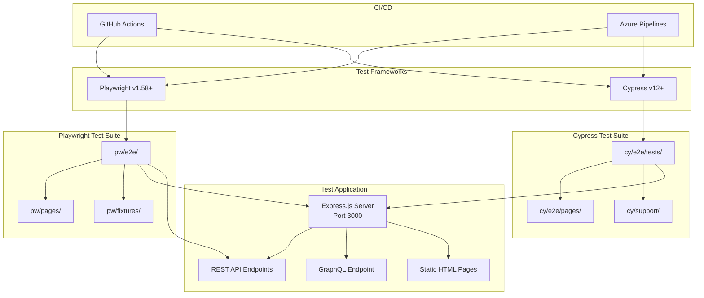
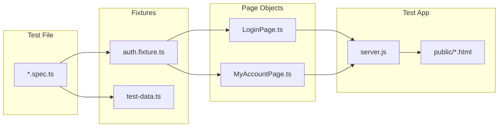
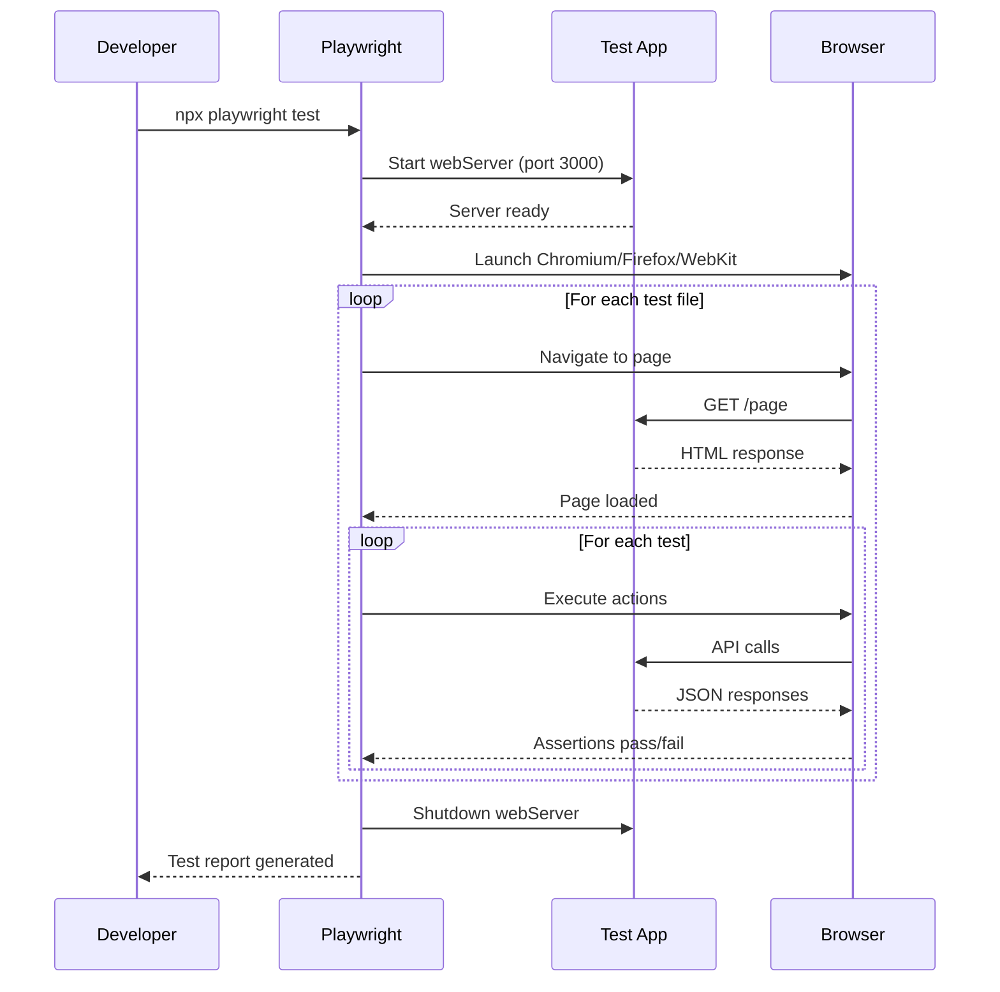
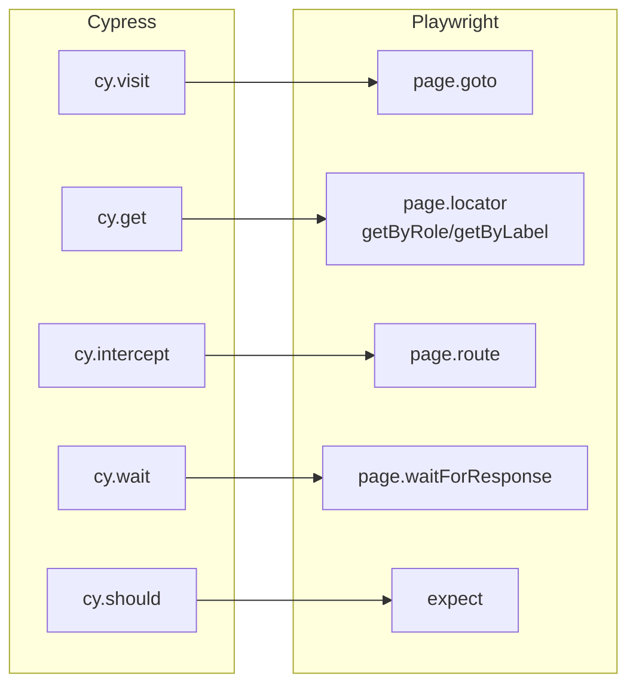

# Cypress ↔ Playwright Hybrid Testing Framework

> A production-grade dual-framework test suite demonstrating Cypress-to-Playwright migration patterns, Page Object Models, and AI-assisted test automation.

[](https://playwright.dev)
[](https://cypress.io)
[](https://nodejs.org)
[](https://www.typescriptlang.org)

---

## Architecture



### Page Object Model Architecture



### Test Execution Flow



### Cypress vs Playwright Command Mapping



---

## Quick Start

```bash
# 1. Clone and install
git clone https://github.com/vbikkaneti/cypress-playwright.git
cd cypress-playwright
npm install

# 2. Install Playwright browsers
npx playwright install

# 3. Run Playwright tests (auto-starts server)
npx playwright test

# 4. View report
npx playwright show-report
```

---

## Project Structure

```
cypress-playwright/
├── app-under-test/              # Express.js test application
│   ├── server.js                #   API + static file server
│   └── public/                  #   HTML pages (login, dashboard, forms, dialogs)
│
├── playwright/                  # Playwright test suite (modern)
│   ├── e2e/                     #   Test specifications
│   │   ├── auth/                #     Authentication tests
│   │   ├── forms/               #     Form interaction tests
│   │   ├── api.spec.ts          #     API & network tests
│   │   ├── smoke.spec.ts        #     Smoke tests
│   │   └── *.spec.ts            #     Other test files
│   ├── pages/                   #   Page Object Models
│   │   ├── LoginPage.ts
│   │   └── MyAccountPage.ts
│   └── fixtures/                #   Test data & auth fixtures
│       ├── auth.fixture.ts
│       └── test-data.ts
│
├── cypress/                     # Cypress test suite (legacy)
│   ├── e2e/tests/               #   15 test files (55 capabilities)
│   ├── e2e/pages/               #   Page Objects
│   ├── support/                 #   Custom commands
│   └── fixtures/                #   Test data (JSON)
│
├── scripts/                     # Utility scripts
│   ├── diagnose-cypress.js      #   Cypress failure diagnosis
│   ├── update_agents.js         #   Agent version sync
│   └── validate-migration.*     #   Migration quality gates
│
├── playwright.config.ts         # Playwright configuration
├── cypress.config.ts            # Cypress configuration
└── package.json                 # Dependencies & scripts
```

---

## Usage Guide

### Running Tests

| Command                                  | Description                           | Auto-Starts Server |
| ---------------------------------------- | ------------------------------------- | :----------------: |
| `npx playwright test`                    | Run all Playwright tests (3 browsers) |         ✅         |
| `npx playwright test --project=chromium` | Chromium only                         |         ✅         |
| `npx playwright test --headed`           | See browser actions                   |         ✅         |
| `npx playwright test --ui`               | Interactive UI mode                   |         ✅         |
| `npx playwright test --debug`            | Step-through debugging                |         ✅         |
| `npx playwright test auth/login`         | Specific test file                    |         ✅         |
| `npm run cy:run`                         | Run all Cypress tests                 |         ❌         |
| `npm run cy:open`                        | Open Cypress Test Runner              |         ❌         |
| `npm run test:hybrid`                    | Run both frameworks in parallel       |      Partial       |

### Playwright Advanced

```bash
# Run with trace recording
npx playwright test --trace on

# Run specific test by title
npx playwright test -g "login with valid"

# Run in different browsers
npx playwright test --project=firefox
npx playwright test --project=webkit

# Generate HTML report
npx playwright show-report test-output/playwright-output/report
```

### Cypress

```bash
# Start server first (separate terminal)
cd app-under-test && npm run dev

# Run specific spec
npx cypress run --spec "cypress/e2e/tests/login.test.ts"

# Run with Allure reporter
npm run cy:run

# Open interactive runner
npm run cy:open
```

### Code Quality

```bash
npm run lint          # ESLint check
npm run lint:fix      # Auto-fix lint issues
npm run type-check    # TypeScript compilation check
npm run validate      # Full validation (type-check + lint + format)
npm run format        # Prettier format
```

---

## Page Object Pattern

### LoginPage (Playwright)

```typescript
// playwright/pages/LoginPage.ts
import { Page, Locator, expect } from "@playwright/test";

export class LoginPage {
  readonly page: Page;
  readonly emailAddressTxt: Locator;
  readonly passwordTxt: Locator;
  readonly signinBtn: Locator;

  constructor(page: Page) {
    this.page = page;
    this.emailAddressTxt = page.locator('[data-testid="email-input"]');
    this.passwordTxt = page.locator('[data-testid="password-input"]');
    this.signinBtn = page.locator('[data-testid="submit-btn"]');
  }

  async login(email: string, password: string) {
    await this.page.goto("/login");
    await this.emailAddressTxt.fill(email);
    await this.passwordTxt.fill(password);
    await this.signinBtn.click();
  }

  async validateSuccessfulLogin() {
    await expect(this.page).toHaveURL(/.*\/dashboard/);
  }
}
```

### Auth Fixture (Playwright)

```typescript
// playwright/fixtures/auth.fixture.ts
import { test as base, Page } from "@playwright/test";
import { LoginPage } from "../pages/LoginPage";

type AuthFixtures = {
  authenticatedPage: Page;
  loginPage: LoginPage;
};

export const test = base.extend<AuthFixtures>({
  authenticatedPage: async ({ page }, use) => {
    const loginPage = new LoginPage(page);
    await loginPage.login("test@example.com", "password123");
    await use(page);
  },
  loginPage: async ({ page }, use) => {
    await use(new LoginPage(page));
  },
});

export { expect } from "@playwright/test";
```

### Using Fixtures in Tests

```typescript
// playwright/e2e/auth/login.spec.ts
import { test, expect } from "../../fixtures/auth.fixture";

test("login with valid credentials", async ({ loginPage, myAccountPage }) => {
  await loginPage.login("test@example.com", "password123");
  await myAccountPage.validateSuccessfulLogin();
  await myAccountPage.logout();
  await myAccountPage.validateSuccessfulLogout();
});
```

---

## Migration Playbook

### Cypress → Playwright Cheat Sheet

| Cypress                                  | Playwright                                               |
| ---------------------------------------- | -------------------------------------------------------- |
| `cy.visit('/page')`                      | `await page.goto('/page')`                               |
| `cy.get('[data-testid="x"]')`            | `page.getByTestId('x')`                                  |
| `cy.contains('text')`                    | `page.getByText('text')`                                 |
| `cy.get('button').click()`               | `await page.getByRole('button').click()`                 |
| `cy.get('input').type('text')`           | `await page.getByLabel('Input').fill('text')`            |
| `cy.intercept('GET', '/api', {})`        | `await page.route('**/api', r => r.fulfill({json: {}}))` |
| `cy.wait('@alias')`                      | `await page.waitForResponse('**/api')`                   |
| `cy.get('.el').should('be.visible')`     | `await expect(page.locator('.el')).toBeVisible()`        |
| `cy.url().should('include', '/path')`    | `await expect(page).toHaveURL(/\/path/)`                 |
| `cy.get('.el').should('have.text', 'x')` | `await expect(page.locator('.el')).toHaveText('x')`      |

### Migration Steps

1. **Analyze** — Read the Cypress test, identify custom commands and dependencies
2. **Create Page Object** — Extract selectors and actions into a class
3. **Create Fixture** — Convert `beforeEach` setup into Playwright fixtures
4. **Migrate Test** — Convert `cy.*` calls to `await page.*` with semantic locators
5. **Verify** — Run `npx tsc --noEmit` then `npx playwright test`
6. **Delete Legacy** — Remove the Cypress test once Playwright equivalent passes

### Quality Gates

```bash
# Before marking migration complete:
grep -r '\bcy\.' playwright/           # Should return nothing
npx tsc --noEmit                        # TypeScript compiles
npx playwright test --project=chromium  # Tests pass
```

---

## Test Application API

The `app-under-test/` Express server provides these endpoints:

| Method | Endpoint             |  Auth  | Description                 |
| ------ | -------------------- | :----: | --------------------------- |
| `GET`  | `/`                  |   No   | Home page with product grid |
| `GET`  | `/login`             |   No   | Login form                  |
| `GET`  | `/dashboard`         |  Yes   | User dashboard              |
| `GET`  | `/forms`             |   No   | Form interaction page       |
| `GET`  | `/dialogs`           |   No   | Dialog triggers             |
| `GET`  | `/upload`            |   No   | File upload page            |
| `POST` | `/api/auth/login`    |   No   | Authenticate user           |
| `POST` | `/api/auth/logout`   |   No   | Clear session               |
| `GET`  | `/api/auth/me`       |  Yes   | Current user info           |
| `GET`  | `/api/products`      |   No   | List products (filterable)  |
| `GET`  | `/api/products/:id`  |   No   | Single product              |
| `GET`  | `/api/orders`        |  Yes   | User orders                 |
| `POST` | `/api/orders`        |  Yes   | Create order                |
| `POST` | `/api/upload`        |   No   | Upload file                 |
| `POST` | `/api/graphql`       | Varies | GraphQL endpoint            |
| `GET`  | `/api/error/:code`   |   No   | Generate error responses    |
| `GET`  | `/api/slow-response` |   No   | Delayed response (testing)  |

**Test Credentials:** `test@example.com` / `password123`

---

## Docker

```bash
# Run everything in containers
npm run test:docker

# Or step by step
docker compose up -d test-app          # Start app only
docker compose run --rm cypress        # Run Cypress tests
docker compose down                     # Cleanup
```

---

## CI/CD

### GitHub Actions (`.github/workflows/hybrid-ci.yml`)

Runs both Cypress and Playwright in parallel on push/PR:

- Playwright: Chromium, Firefox, WebKit
- Cypress: Chrome, Edge
- Merged test reports as artifacts

### Azure Pipelines (`.azure-pipelines/`)

- `auto-heal-tests.yml` — Auto-heal failing tests
- `ai-session-logger.yml` — Log AI agent sessions
- `requirement-tracer.yml` — Trace requirements to tests

---

## AI Agents

The `.github/agents/` directory contains specialized AI agents for test automation:

| Agent                       | Purpose                                                                |
| --------------------------- | ---------------------------------------------------------------------- |
| `qa-orchestrator`           | Central coordinator for test creation, debugging, and orchestration    |
| `playwright-test-generator` | Generate Playwright tests from requirements                            |
| `playwright-test-planner`   | Plan test strategies and coverage                                      |
| `playwright-healer`         | Diagnose and fix broken Playwright tests                               |
| `cypress-to-playwright`     | Migrate Cypress tests to Playwright                                    |
| `cypress-healer`            | Diagnose and fix broken Cypress tests                                  |
| `qa-architect`              | Design test frameworks, CI/CD integration, and infrastructure          |
| `qa-engineer`               | Write and maintain test suites                                         |
| `automation-engineer`       | Build and maintain automation frameworks                               |
| `sdet`                      | Advanced test frameworks, custom tooling, performance/security testing |
| `manual-tester`             | Manual test case design and exploratory testing                        |
| `test-engineer`             | General test engineering and quality assurance                         |
| `qa-automation-engineer`    | QA-specific automation patterns and workflows                          |
| `backend-specialist`        | Backend API and server-side testing                                    |
| `frontend-specialist`       | Frontend UI testing and visual validation                              |
| `database-architect`        | Database schema testing and data integrity                             |
| `devops-engineer`           | CI/CD pipeline and infrastructure testing                              |
| `debugger`                  | Test failure diagnosis and root cause analysis                         |
| `documentation-writer`      | Test documentation and reporting                                       |

### AI Prompts & Skills

| Directory                          | Contents                                     |
| ---------------------------------- | -------------------------------------------- |
| `.github/prompts/cypress/`         | Cypress test creation and healing prompts    |
| `.github/prompts/playwright/`      | Playwright test creation and healing prompts |
| `.github/prompts/migration/`       | Cypress → Playwright migration prompts       |
| `.github/skills/clean-code/`       | Code quality and style guidelines            |
| `.github/skills/testing-patterns/` | Testing best practices and patterns          |
| `.github/skills/webapp-testing/`   | Web application testing strategies           |

**Usage (with GitHub Copilot):**

```
@qa-orchestrator create tests for checkout flow
@cypress-to-playwright migrate cypress/e2e/tests/login.test.ts
@playwright-healer fix playwright/e2e/smoke.spec.ts
@sdet build performance testing framework
@devops-engineer set up CI/CD pipeline
```

---

## Troubleshooting

| Issue                       | Solution                                             |
| --------------------------- | ---------------------------------------------------- |
| Port 3000 in use            | `npx kill-port 3000` or stop other servers           |
| Playwright browsers missing | `npx playwright install`                             |
| TypeScript errors           | `npx tsc --noEmit` to see details                    |
| Tests timeout               | Check if server starts: `curl http://localhost:3000` |
| Cypress can't find element  | Verify `data-testid` attributes in HTML              |

---

## Further Reading

| Document                                                  | Description                                 |
| --------------------------------------------------------- | ------------------------------------------- |
| [Migration Guide](./docs/MIGRATION_GUIDE.md)              | Step-by-step Cypress → Playwright migration |
| [Beginner Guide](./docs/BEGINNER_GUIDE.md)                | Zero-to-hero test automation tutorial       |
| [TypeScript Guide](./docs/TYPESCRIPT_FOR_CYPRESS.md)      | TypeScript basics for test automation       |
| [Docker Guide](./docs/DOCKER_HELPER.md)                   | Running tests in containers                 |
| [Security Policy](./docs/SECURITY.md)                     | Security reporting and best practices       |
| [Copilot Instructions](./.github/copilot-instructions.md) | AI agent migration rules                    |

---

## License

MIT
