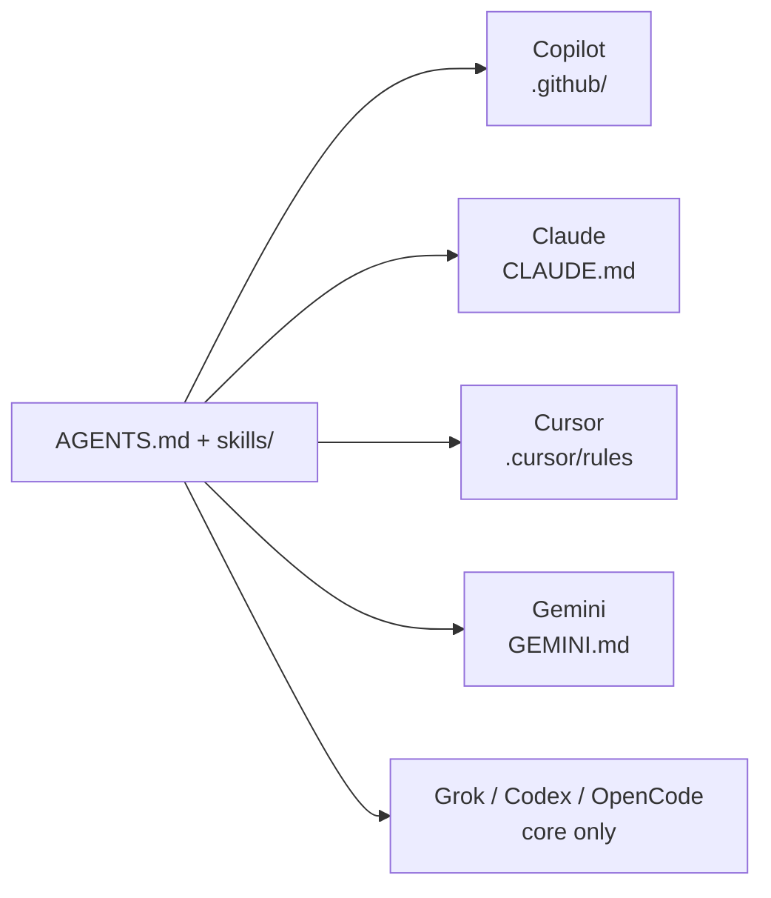

# What is in this repository

This GitHub repo is **two things glued together on purpose**:

1. **A publishable toolkit** (`plugin/`) — copies `AGENTS.md` + Agent Skills into *your* Cypress repo so Copilot, Claude, Cursor, Grok, Codex, Gemini, and OpenCode all run the same migration procedure.
2. **A worked example** — a small Express app with a Cypress suite *and* a Playwright twin, so you can see the mapping on real specs.

It is **not** “install this whole repo as a test framework.” Do not `npm i` the demo app and expect a migrator. Consume `plugin/`.

## Top-level map

```text
cypress-playwright/
├── AGENTS.md                 Always-on contract (locators, storageState, gates)
├── skills/                   Playbooks (4 for consumers + 2 repo-only)
├── plugin/                   npm package cypress2playwright-using-ai
│   ├── bin/setup.js          File-copy installer (no network, no AST)
│   └── templates/            AGENTS.md, 4 skills, thin vendor adapters
├── playwright/               Target suite (POM, storageState, getByRole)
├── cypress/                  Source suite (stay until the twin is green)
├── app-under-test/           Express :3000 — demo only, not published
├── docs/                     Setup, workflow diagrams, architecture.html, demo video
├── .github/                  Copilot adapter + hybrid CI
├── CLAUDE.md / GEMINI.md     Thin vendor adapters
└── CONTRIBUTING.md           Merge-commit, do not squash feature PRs
```

## What each area is for

| Path | Audience | Role |
| --- | --- | --- |
| `plugin/` | Teams with a Cypress repo | The product you install |
| `AGENTS.md` + `skills/{cypress-to-playwright-migration,playwright-testing,code-review,webapp-testing}` | Every coding agent | Procedure |
| `skills/architecture-diagram` | Maintainers of *this* repo | Generate [architecture.html](./architecture.html) |
| `skills/skill-creator` | Maintainers of *this* repo | Draft / eval new skills |
| `playwright/` + `cypress/` | Learners / CI | Dual-run example |
| `app-under-test/` | Learners / CI | Pages the example tests hit |
| `docs/` | Humans | Setup, diagrams, video |

## What npm publishes vs what you clone

| Artifact | Path | On npm? |
| --- | --- | --- |
| Installer CLI | `plugin/bin/setup.js` | yes |
| Portable core | `plugin/templates/_shared/` | yes |
| Vendor adapters | `plugin/templates/{claude,cursor,gemini,copilot}/` | yes |
| Cypress + Playwright example | repo root | **no** |
| Express SUT | `app-under-test/` | **no** |
| Interactive architecture | `docs/architecture.html` | **no** |
| Demo video | `docs/demo/setup-and-use.mp4` | **no** |
| architecture-diagram / skill-creator | `skills/` | **no** |

## Agent matrix (short)



Full matrix: [ENTERPRISE_AGENTS.md](./ENTERPRISE_AGENTS.md).
