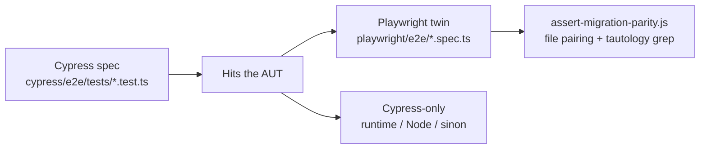

# Cypress vs Playwright parity

This is the **case-level** map. [CAPABILITIES.md](./CAPABILITIES.md) is the Cypress **command** matrix. [COMMAND_MAP.md](./COMMAND_MAP.md) is custom commands only.

Cypress is the source of truth. Playwright files exist only as twins. Equal *file* count is not enough — a twin that drops an AUT assertion is a fake migration.

**Numbers on `main`:** 21 Cypress specs (252 cases) → 21 Playwright twins (211 cases) + 1 setup project (`auth.setup.ts`). Chromium runs **212** tests. The −41 case gap is *intentional* (combined twins + Cypress-only helpers), not dropped AUT coverage.

## How to read a row

| Status | Meaning |
| --- | --- |
| **1:1** | Same number of cases; same AUT intent. Playwright titles may drop the `cy.` prefix. |
| **Combined** | Two Cypress cases folded into one Playwright test (same assertions, one navigation). |
| **Cypress-only** | Cypress runtime / Node / sinon capability. No Playwright twin on purpose — a fake twin would be `expect(true).toBe(true)`. |

New AUT behavior is added in Cypress first, then migrated. Never author a Playwright-only spec.

## Scoreboard

| Spec | Cypress | Playwright | Status |
| --- | ---: | ---: | --- |
| [a11y](../cypress/e2e/tests/a11y.test.ts) | 3 | 3 | 1:1 |
| [actions](../cypress/e2e/tests/actions.test.ts) | 14 | 14 | 1:1 (`trigger` → `input` event) |
| [api](../cypress/e2e/tests/api.test.ts) | 21 | 21 | 1:1 (`intercept` → `page.route`) |
| [browser](../cypress/e2e/tests/browser.test.ts) | 22 | 16 | Combined + Cypress-only — [details](#browser) |
| [clock](../cypress/e2e/tests/clock.test.ts) | 2 | 2 | 1:1 |
| [custom-commands](../cypress/e2e/tests/custom-commands.test.ts) | 11 | 11 | 1:1 — [COMMAND_MAP.md](./COMMAND_MAP.md) |
| [debug](../cypress/e2e/tests/debug.test.ts) | 1 | 1 | 1:1 |
| [dialogs](../cypress/e2e/tests/dialogs.test.ts) | 22 | 20 | 2 Cypress-only sinon stubs — [details](#dialogs) |
| [forms](../cypress/e2e/tests/forms.test.ts) | 33 | 33 | 1:1 |
| [graphql](../cypress/e2e/tests/graphql.test.ts) | 10 | 10 | 1:1 (live spy is **not** the mock) |
| [login](../cypress/e2e/tests/login.test.ts) | 9 | 9 | 1:1 + POM + `users.json` |
| [myAccount](../cypress/e2e/tests/myAccount.test.ts) | 6 | 6 | 1:1 + POM + `storageState` |
| [origin](../cypress/e2e/tests/origin.test.ts) | 2 | 2 | 1:1 (secondary origin) |
| [security](../cypress/e2e/tests/security.test.ts) | 4 | 4 | 1:1 |
| [session](../cypress/e2e/tests/session.test.ts) | 5 | 4 | Combined `cy.session` cache+restore — [details](#session) |
| [smoke](../cypress/e2e/tests/smoke.test.ts) | 6 | 6 | 1:1 |
| [storage](../cypress/e2e/tests/storage.test.ts) | 22 | 14 | Combined cookie-jar extras — [details](#storage) |
| [system](../cypress/e2e/tests/system.test.ts) | 7 | 1 | Cypress-only Node I/O — [details](#system) |
| [traversal](../cypress/e2e/tests/traversal.test.ts) | 26 | 26 | 1:1 (wrap/spread read `/dom` fruit) |
| [upload](../cypress/e2e/tests/upload.test.ts) | 6 | 6 | 1:1 |
| [utilities](../cypress/e2e/tests/utilities.test.ts) | 20 | 2 | Cypress-only runtime — [details](#utilities) |
| **Totals** | **252** | **211** | + `auth.setup.ts` (Chromium 212) |

## 1:1 specs (no dropped AUT cases)

These pairs match case-for-case. Playwright uses its own APIs (`fill` / `press` / `page.route` / `expect`) instead of Cypress-shaped wrappers.

| Pair | What the twin must still prove |
| --- | --- |
| a11y | Logo `alt`, nav landmark, login `role=alert` |
| actions | Click variants, dblclick, rightclick, hover, HTML5 drag, slider, Escape, native submit |
| api | Fixture stub, AUT-rendered stub, delay, 500 body, outgoing login body via `LoginPage`, live `POST /api/todos`, `/api/error/:code` |
| clock | Frozen client clock; delayed banner via `clock.fastForward`, not a 5s sleep |
| custom-commands | Every command in [COMMAND_MAP.md](./COMMAND_MAP.md) hits the AUT |
| debug | Home heading visible (not a tautological title print) |
| forms | Keyboard shortcuts, clear+retype, Germany selected text, focus/blur buttons, arrow increment |
| graphql | Products query, variables, 404 product, auth user, `UNAUTHENTICATED`, createOrder `items.length === 2`, **mock and live spy as two cases** |
| login | Fixture users (valid / admin / invalid / format / short password), `loginFromHome`, Remember me session vs local |
| myAccount | Dashboard + user info + hide/show Orders/Products/Settings + logout |
| origin | Same AUT on the secondary origin; fixture email types into the login field |
| security | XSS as `textContent`, unauth redirect, nosniff/`DENY`/no `X-Powered-By`, HttpOnly auth cookie |
| smoke | Home, products, login page, GET products, UI login, API login → dashboard |
| traversal | Query/traversal/`*Until`, wrap/spread from AUT fruit, shadow root, same-origin iframe |
| upload | In-memory file, fixture file, multi, drop, POST upload, download |

### Cross-browser twins (same AUT assertion, different event)

Playwright runs Chromium + Firefox + WebKit. Cypress on CI is Chrome only. Two twins have to map a Chrome-shaped event onto a browser that does not fire it:

- **actions / slider** — Cypress `trigger(mousedown/mousemove, { clientX })`. Playwright real-mouse with `{ steps: 16 }`. Firefox often swallows a 1-step `mouse.move` teleport; if the AUT value is still ≤50 the twin dispatches the same MouseEvents Cypress sent.
- **upload / download** — Cypress `click` + `readFile(downloadsFolder)`. Playwright `waitForEvent('download')`. WebKit on Linux often navigates a `text/plain` attachment instead of emitting that event; the AUT link has `download="sample.txt"` and the twin then asserts the sample bytes on `body`.

## Combined and Cypress-only (the −41)

### browser

| Cypress case | Playwright | Why |
| --- | --- | --- |
| scroll to bottom **and** scroll to top | one test: bottom then top, `scrollY === 0` | Combined |
| navigate back **and** navigate forward | one test: back then forward | Combined |
| scroll to top **button** | twin | AUT-real |
| scroll within container | twin against `#scroll-container` (`scrollLeft` **increases**) | AUT-real |
| location properties | twin (`pathname` / `protocol` / `host`) | AUT-real |
| preset viewport names (`iphone-6`, …) | **Cypress-only** | Cypress preset table; Playwright uses `{ width, height }` |
| all responsive breakpoints | **Cypress-only** | Same as presets — heading-visible loop, no extra AUT flag |
| scroll with `{ duration: 1000 }` | **Cypress-only** | Cypress animation option; Playwright has no equivalent |
| `cy.reload(true)` force cache | **Cypress-only** | Cypress-only reload flag |

Dimensions / mobile / tablet / landscape **are** twinned (`#viewport-flag`).

### dialogs

Native dialogs: `page.once("dialog")` **before** `click()`. `error-btn` is swallowed **only** when the message includes `"Test error"`.

| Cypress case | Playwright |
| --- | --- |
| stub confirm for detailed assertions | **Cypress-only** — `cy.stub(win, "confirm")` call-count. Accept / reject / capture already twin the AUT. |
| dynamic prompt responses | **Cypress-only** — sinon `callsFake`. Return-value / cancel / default-value already twin the AUT. |

Alert stub, console spy, `window.open` stub+params, beforeunload, pageerror **are** twinned.

### session

| Cypress | Playwright |
| --- | --- |
| `should log in via session for Test 1` + `should restore session for Test 2` | **Combined** → `restores dashboard from storageState without UI login` (`auth.setup.ts` + `storageState`) |
| `cy.login()` lands on dashboard | `login helper twin lands on dashboard` |
| navigation with restored session | hide/show `orders-section` (must be able to fail) |
| session clearing | cookies + local/session storage cleared → `/login` |

`auth.setup.ts` checks **Remember me** because Playwright `storageState` does not restore `sessionStorage`.

### storage

Cookie-jar / `getAll*` extras that only exist as Cypress APIs stay Cypress-only. AUT-real twins:

| Kept as twin | Cypress-only (no AUT difference) |
| --- | --- |
| set+get cookie, clear one, clear all, server `authToken` HttpOnly, `getAllCookies` list | `set cookie with options`, `get all cookies` (duplicate), `assert on cookie properties` |
| set+get localStorage, UI set/clear, logout clears token | `clear specific key`, `clear matching pattern`, `storage isolation`, `assert localStorage values` (same store) |
| sessionStorage set/get/clear, `getAllLocalStorage` then clear, `getAllSessionStorage` round-trip | — |

### system

| Cypress | Playwright |
| --- | --- |
| `products.json` fixture drives the home product grid | **twin** — AUT-real |
| `cy.exec`, `cy.task` (log / get value / server-side read), `cy.writeFile` / `cy.readFile`, `cy.fixture()` load-only | **Cypress-only** Node I/O. A Playwright `fs.readFile` of the same JSON would not prove the AUT. |

### utilities

| Cypress | Playwright |
| --- | --- |
| `cy.screenshot()` of the home heading | twin — file exists **and** heading is visible |
| `cy.document()` | twin — `document.readyState === "complete"` on `/` |
| `Cypress._` / `minimatch` / `Promise` / `Blob` / `$` / `dom` / `isCy` / `config` / `env` / `browser` / `log` / `debug` / `Cookies.debug` / `Keyboard.defaults` / `Screenshot.defaults` / `currentTest` | **Cypress-only** runtime. Ruling: do not invent lodash-arithmetic twins. |

Custom-command demos inside `utilities.test.ts` are already proven in `custom-commands.test.ts`.

## Pages, fixtures, commands

### Page objects (POM)

Required for login / account (3+ interactions). Kitchen-sink click/traversal may use `getByTestId`.

| Cypress | Playwright | Methods that must exist on both |
| --- | --- | --- |
| `cypress/e2e/pages/loginPage.ts` | `playwright/pages/LoginPage.ts` | `launchApplication`, `navigateToLogin`, `login`, `loginFromHome`, `validateLoginError`, `validateEmailError`, `validatePasswordError`, `validateSuccessfulLogin` |
| `cypress/e2e/pages/myAccountPage.ts` | `playwright/pages/MyAccountPage.ts` | `validateSuccessfulLogin`, `validateUserInfo`, `logout`, `validateSuccessfulLogout`, `navigateToOrders`, `navigateToProducts`, `navigateToSettings` |

Playwright locators on these pages: `getByRole` / `getByLabel` first. Cypress pages still use `data-testid` (Cypress SoT style). Playwright `login(..., rememberMe = true)` is the extra flag `auth.setup.ts` needs.

### Fixtures

| Cypress | Playwright | Rule |
| --- | --- | --- |
| `cypress/fixtures/users.json` | `playwright/fixtures/test-data.ts` **reads that file** | Single credential source. No `test@example.com` literals in specs. |
| `cypress/fixtures/products.json` | `api.spec.ts` reads the same file for intercept stubs | Same JSON the AUT grid asserts against. |
| — | `playwright/fixtures/auth.fixture.ts` | Injects `LoginPage` / `MyAccountPage` into login + myAccount specs. |
| — | `playwright/e2e/auth.setup.ts` | Extra Playwright file (allowed). Writes `storageState` after Remember-me login. |

`task-read.txt` / `temp-system-test.json` are Cypress `cy.task` / `cy.readFile` inputs — not twinned.

### Custom commands

See [COMMAND_MAP.md](./COMMAND_MAP.md). Every `Cypress.Commands.add` / `addQuery` / `overwrite` name must appear in `custom-commands.test.ts` **and** that map. Playwright equivalents are functions in `playwright/helpers/commands.ts` or POM methods — never a global `cy.*` registry.

## What the gate actually checks

`node plugin/scripts/assert-migration-parity.js` (also `cd plugin && npm test`):

1. Every `*.test.ts` has `playwright/e2e/<base>.spec.ts`
2. Extra Playwright specs fail, except `auth.setup.ts`
3. Page files mapped (`PAGE_MAP`) and listed methods exist on both
4. Custom command names are in the catalog spec + `COMMAND_MAP.md`
5. `test-data.ts` reads `users.json`
6. Tautology grep: `expect(true)`, `test.info().title`, `process.platform`, `browserName).toBeTruthy`, Ada wrap, literal fruit array
7. `test.skip` / `it.skip` require a nearby `Cypress-only` comment

It does **not** count cases or match titles. This file is the case-level contract. If you drop an AUT-real case, update the twin — do not “fix” the scoreboard by deleting the Cypress test.

## How to add coverage

1. Write the Cypress spec against the AUT. If it can pass when the AUT is wrong, it is not a test.
2. Migrate the Playwright twin. Mirror intent; do not drop cases.
3. If the Cypress API has no Playwright equivalent (`cy.exec`, `Cypress._`, viewport presets), leave it Cypress-only and add a row here — never a tautological twin.
4. If two Cypress cases are one Playwright flow (back+forward), say **Combined** here.
5. Run the gates in `AGENTS.md`. Isolated review (`skills/code-review`) before merge.
