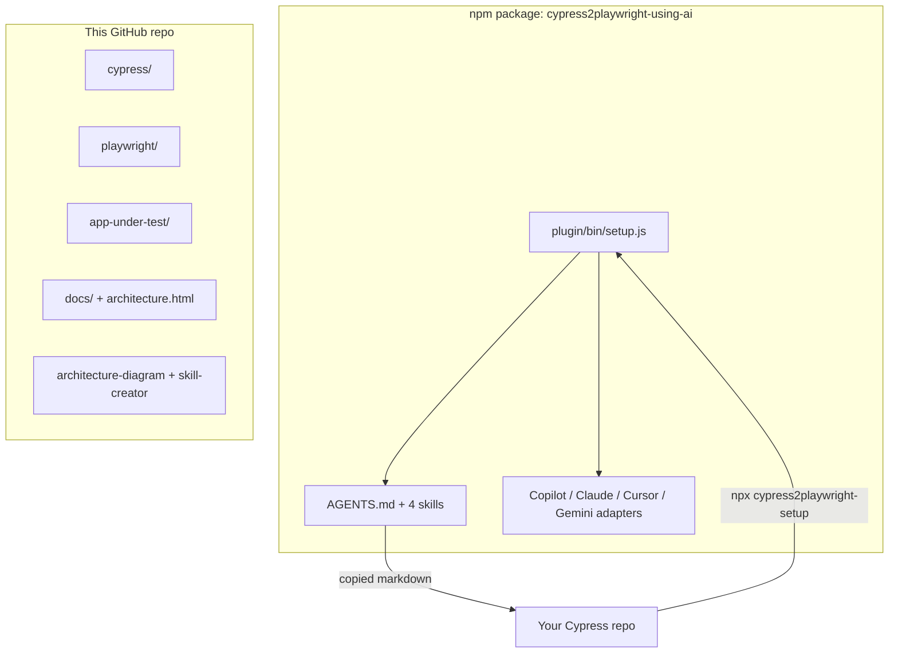

# Documentation

How to set up, migrate, and operate this toolkit. Interactive map: [architecture.html](./architecture.html). Screen recording: [demo/setup-and-use.mp4](./demo/setup-and-use.mp4).

## Start here

| You are… | Read |
| --- | --- |
| New to the repo | [INVENTORY.md](./INVENTORY.md) — what is in it |
| Installing into *your* Cypress app | [SETUP.md](./SETUP.md) |
| Want the pictures | [WORKFLOW.md](./WORKFLOW.md) + [architecture.html](./architecture.html) |
| Merging a PR | [../CONTRIBUTING.md](../CONTRIBUTING.md) — **do not squash** feature work |
| Picking an AI tool | [ENTERPRISE_AGENTS.md](./ENTERPRISE_AGENTS.md) |
| Running the dual demo | [SETUP.md](./SETUP.md#demo-this-repository-optional) |
| Cypress command coverage | [CAPABILITIES.md](./CAPABILITIES.md) |
| Writing / healing tests | [../AGENTS.md](../AGENTS.md) + `skills/` |
| Security of the installer | [SECURITY.md](./SECURITY.md) |

## Two products (do not mix them up)

The npm package is **markdown + a file-copy CLI**. It is not the Express demo app.

## Skills

| Skill | Ships to consumers? | Purpose |
| --- | --- | --- |
| `cypress-to-playwright-migration` | yes | Convert one spec / command |
| `playwright-testing` | yes | Write / heal Playwright |
| `code-review` | yes | Isolated git-range review |
| `webapp-testing` | yes | Coverage planning |
| `architecture-diagram` | **no** — this repo | Click-through HTML diagrams ([upstream](https://github.com/konraddzbik/architecture-diagram-skill)) |
| `skill-creator` | **no** — this repo | Author and eval new skills ([upstream](https://github.com/anthropics/skills/tree/main/skills/skill-creator)) |

Third-party licenses: [../skills/THIRD_PARTY.md](../skills/THIRD_PARTY.md).

## Demo video

[demo/setup-and-use.mp4](./demo/setup-and-use.mp4) walks through:

1. Consumer install (`npx cypress2playwright-setup`)
2. Prompting any agent to migrate one spec
3. The interactive architecture (Setup → Migrate → Auth → Review → CI)

How the recording is produced: [demo/README.md](./demo/README.md).
