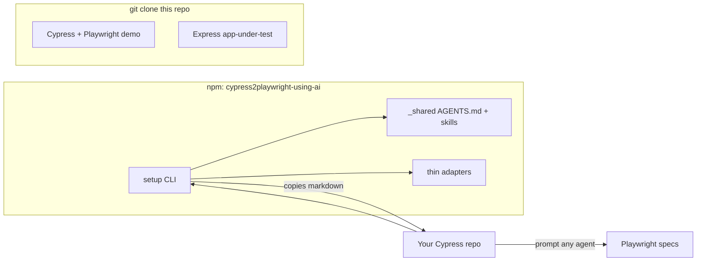
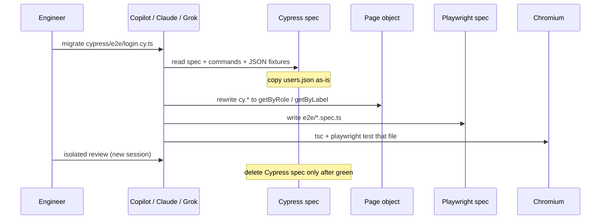

# Setup and use

How a team with a Cypress suite installs this toolkit and migrates tests. Interactive walkthrough: [architecture.html](./architecture.html). Screen recording: [demo/setup-and-use.mp4](./demo/setup-and-use.mp4).

## Two products, one GitHub repo



Do **not** install the demo app as the toolkit. Publish / consume **`plugin/`** only.

Until the package is on npm:

```bash
git clone https://github.com/veeresh-bikkaneti/cypress-playwright.git
cd your-cypress-app
node /path/to/cypress-playwright/plugin/bin/setup.js setup --tools copilot,claude,cursor
```

After publish:

```bash
npm i -D cypress2playwright-using-ai
npx cypress2playwright-setup setup --tools copilot,claude,cursor
```

## What gets written

Always: `AGENTS.md`, `skills/` (mirrored to `.agents/skills` and `.github/skills`).

Optional adapters:

| Flag | Files |
| --- | --- |
| `copilot` | `.github/copilot-instructions.md`, `.github/agents/*.agent.md` |
| `claude` | `CLAUDE.md`, `.claude/commands/` |
| `cursor` | `.cursor/rules/cypress-playwright.mdc` |
| `gemini` | `GEMINI.md` |
| `grok` / `codex` / `opencode` | core only |

Then **you** still add Playwright (the installer does not):

```bash
npm init playwright@latest   # beside Cypress, do not delete Cypress
```

Commit `AGENTS.md` and `skills/` so every agent on the team sees the same rules.

## Migration order



1. Inventory custom commands, `cy.session`, intercepts, fixtures.
2. Migrate **auth + 1–2 page objects** first (`storageState` setup project).
3. Copy JSON fixtures (or import from `cypress/fixtures/`).
4. Convert specs that use those POMs — one file per agent session.
5. Dual CI until coverage matches.

Prompt:

> Migrate `cypress/e2e/login.cy.ts` using `skills/cypress-to-playwright-migration`. Reuse existing Page Objects. Do not UI-login if `storageState` exists.

## Copy vs rewrite

| Artifact | Do this |
| --- | --- |
| `users.json` / `products.json` | Copy or `import` |
| Page objects using `cy.get` | Rewrite with `Page` + locators |
| `cy.login` / other commands | POM method, fixture, or helper — once |
| `cy.session` | Setup project + `storageState` |
| `cy.intercept` + `cy.wait('@alias')` | `page.route` + `waitForResponse` *before* the click |
| `cy.origin` | Drop the wrapper; `page.goto` other origins |
| App HTML / server | Not tests. Leave it |

## Quality gates

- `npx tsc --noEmit`
- `npx playwright test <file> --project=chromium`
- Isolated `skills/code-review` on a **new** chat with a git range
- No `page.waitForTimeout`, no leftover `cy.*`

## Demo this repository (optional)

```bash
git clone https://github.com/veeresh-bikkaneti/cypress-playwright.git
cd cypress-playwright
npm install
npx playwright install chromium
npx playwright test --project=chromium
```

That is the **worked example**, not the consumer install.

Open [architecture.html](./architecture.html) for the click-through system map. Diagrams in Markdown: [WORKFLOW.md](./WORKFLOW.md). What lives where: [INVENTORY.md](./INVENTORY.md). Agent matrix: [ENTERPRISE_AGENTS.md](./ENTERPRISE_AGENTS.md). Screen recording: [demo/setup-and-use.mp4](./demo/setup-and-use.mp4).

## Merge

When this work lands on `main`, use **Create a merge commit**. Do not squash. See [CONTRIBUTING.md](../CONTRIBUTING.md).
