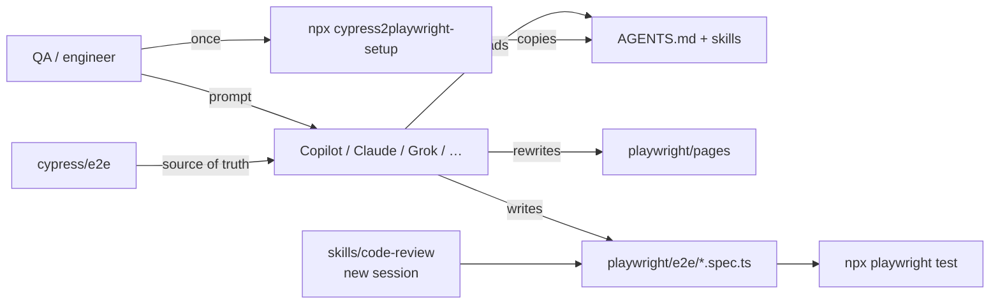
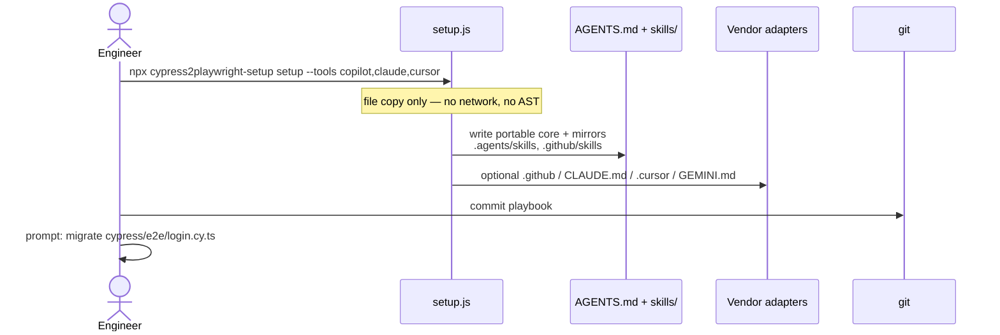
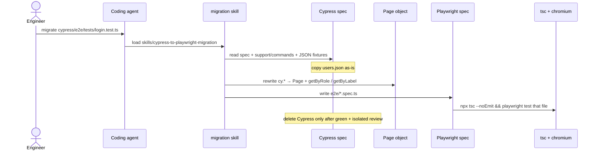
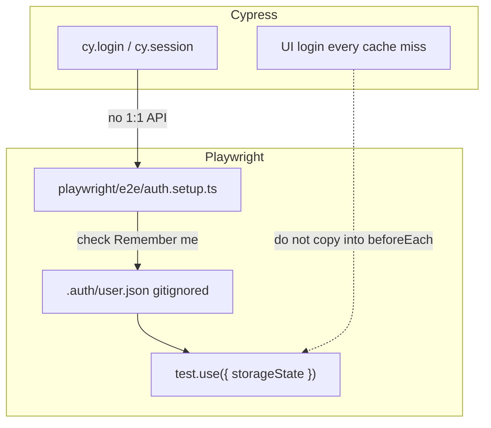
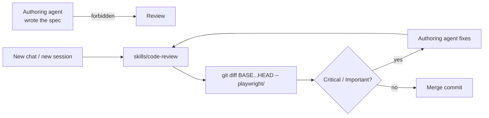
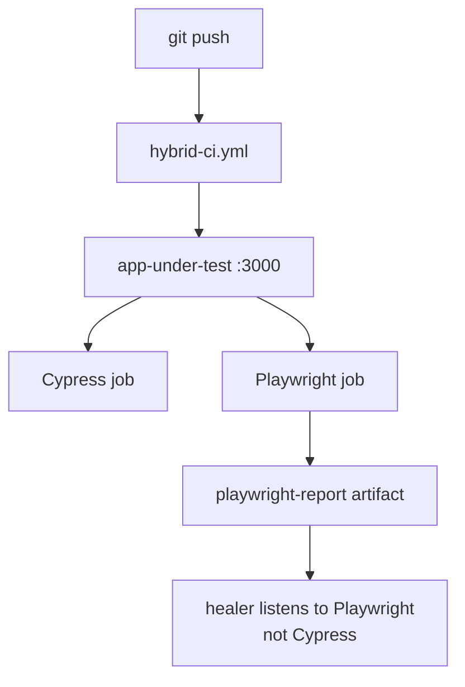
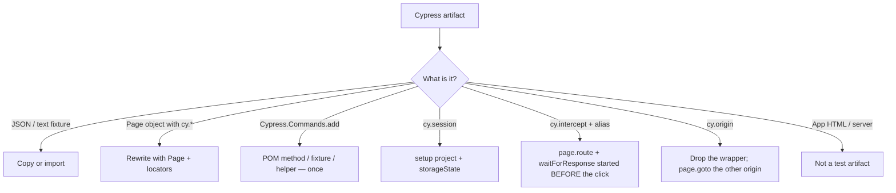
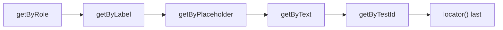
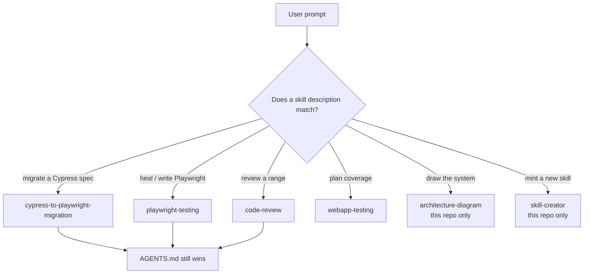
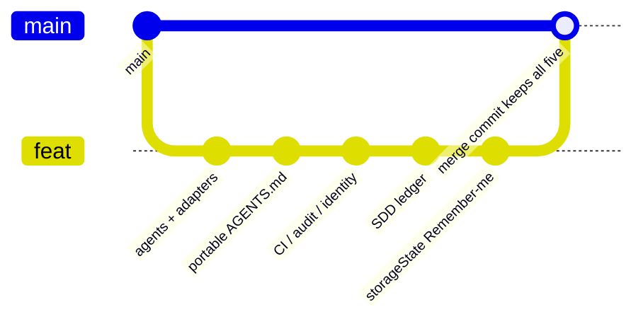

# Workflow diagrams

Companion to the click-through map: [architecture.html](./architecture.html) (open in a browser, press Play). This page is the GitHub-readable version — same flows, as Mermaid.

Toggle meaning in the HTML:

- **Consumer** — you ran `npx cypress2playwright-setup` inside *your* Cypress repo.
- **Demo repo** — this GitHub repository (dual suites + Express). Not what npm publishes.

---

## 1. Big picture

---

## 2. Setup (installer)

Grok, Codex, and OpenCode need **no** extra files. They already read `AGENTS.md`.

---

## 3. Migrate one spec

Order of work:

1. Inventory custom commands, `cy.session`, intercepts, fixtures.
2. Auth + 1–2 page objects first (`storageState` setup project).
3. Convert specs that use those POMs — **one file per agent session**.
4. Dual CI until coverage matches.

---

## 4. Auth: `cy.session` → `storageState`

Playwright restores cookies + `localStorage`. It does **not** restore `sessionStorage`. The demo login must tick **Remember me** or authenticated specs start logged out.

Login-page tests stay unauthenticated (empty storage).

---

## 5. Isolated review

The authoring agent does not review its own diff. Claude: `/review`. Copilot: new chat. Grok: new conversation. Pass a git range.

---

## 6. Hybrid CI (demo repo)

Jobs are **parallel**. Do not gate Playwright on Cypress. Consumers copy the *job shape*, not this repo's paths, and point `webServer` at *their* app.

---

## 7. Copy vs rewrite

---

## 8. Locator order (contract)

Never `page.waitForTimeout`. Await every action and assertion. No leftover `cy.*` in `playwright/`.

---

## 9. Skill loading

---

## 10. Merge — why not squash

Squash would hide the Remember-me ruling inside one synthetic commit. See [CONTRIBUTING.md](../CONTRIBUTING.md).
