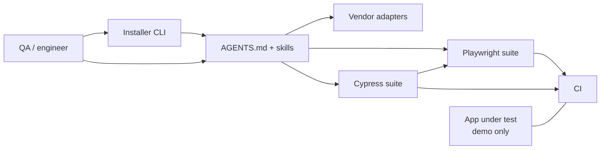
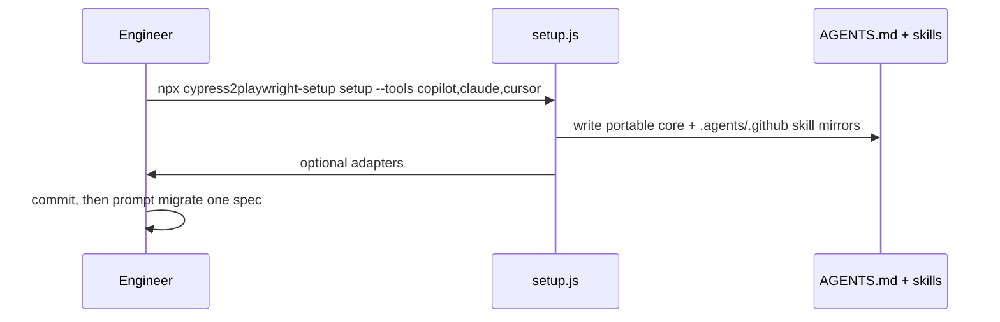
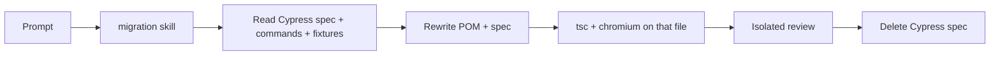
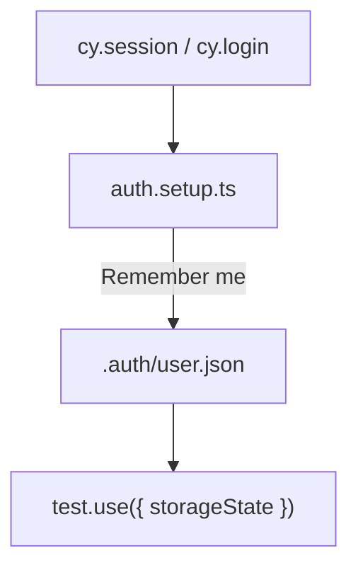
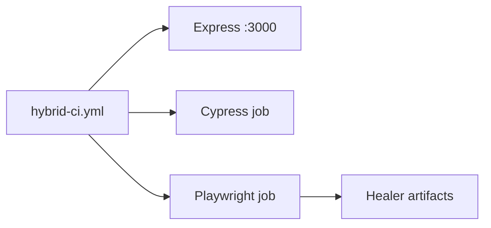

# Cypress2Playwright architecture

Companion to the interactive diagram: [architecture.html](./architecture.html).

Open the HTML in a browser (`open docs/architecture.html`). Click a flow tab, press Play, or drag nodes. Toggle **Consumer** vs **Demo repo**. Keyboard: `1`–`5` flows, `Space` play, `O` mode, `T` theme, `F` fullscreen.

This file was produced with [`skills/architecture-diagram`](../skills/architecture-diagram/SKILL.md) (upstream: [konraddzbik/architecture-diagram-skill](https://github.com/konraddzbik/architecture-diagram-skill)). Static Mermaid twins: [WORKFLOW.md](./WORKFLOW.md). Setup: [SETUP.md](./SETUP.md). Video: [demo/setup-and-use.mp4](./demo/setup-and-use.mp4).

- **Consumer** (`offline` in the player) — you run `npx cypress2playwright-setup` inside *your* Cypress repo.
- **Demo repo** (`online`) — this GitHub repository: dual Cypress + Playwright suites plus a tiny Express app. Not what npm publishes.

## Components

| Node | Role | What it is |
| --- | --- | --- |
| QA / engineer | Entry | You, prompting Copilot / Claude / Grok / Cursor / Codex / Gemini / OpenCode |
| Installer CLI | Job | `plugin/bin/setup.js` — copies markdown. No AST, no network |
| AGENTS.md + skills | Orchestrator | Always-on contract + on-demand playbooks ([Agent Skills](https://agentskills.io/specification)) |
| Vendor adapters | Preprocessor | Thin Copilot / Claude / Cursor / Gemini files. Grok / Codex / OpenCode = core only |
| Cypress suite | Source | Specs, custom commands, JSON fixtures. Stay until the Playwright twin is green |
| Playwright suite | Target | Page objects, `storageState`, `getByRole` / `getByLabel` |
| App under test | Demo-only | Express on :3000. **Not published** with the npm package |
| CI | Job | Parallel Cypress + Playwright jobs. Healer listens to Playwright artifacts |

## What npm publishes vs what this repo is

| Package | Path | Ships |
| --- | --- | --- |
| `cypress2playwright-using-ai` | [`plugin/`](../plugin/) | CLI + templates (`AGENTS.md`, 4 skills, adapters) |
| `cypress-capabilities-demo` | repo root | Dual-framework **example**. Clone it; do not `npm i` it as the toolkit |

Repo-only skills (`architecture-diagram`, `skill-creator`) stay in `skills/` and are **not** copied by the installer. See [skills/README.md](../skills/README.md).

## Flows

### 1. Setup

1. Engineer runs `npx cypress2playwright-setup setup --tools copilot,claude,cursor`.
2. Installer writes `AGENTS.md` + `skills/` (and mirrors into `.agents/skills`, `.github/skills`).
3. Optional adapters: `.github/`, `CLAUDE.md`, `.cursor/rules`, `GEMINI.md`.
4. Commit those files. Prompt: *Migrate `cypress/e2e/login.cy.ts` using the migration skill.*

### 2. Migrate a spec

1. Agent loads `skills/cypress-to-playwright-migration`.
2. Reads the Cypress spec + `support/commands` + JSON fixtures (**copy fixtures as-is**).
3. Rewrites Page Object + `playwright/e2e/*.spec.ts`. Custom commands → POM / fixture, never a global `cy.*` registry.
4. `npx tsc --noEmit` then `npx playwright test <file> --project=chromium`. Isolated review. Then delete Cypress.

### 3. Auth → storageState

`cy.session` has no Playwright twin. Setup project logs in once (check **Remember me** so `localStorage` persists), writes `.auth/user.json`. Authenticated specs `test.use({ storageState })`. Login-page tests stay unauthenticated.

### 4. Isolated review

New session. `skills/code-review` + git range. Authoring agent does not review its own diff. Critical / Important block merge.

### 5. Hybrid CI (demo mode)

Starts `app-under-test`, runs Cypress and Playwright as **parallel** jobs. Consumers point `webServer` at *their* app and copy the job shape, not this repo's paths.

## Copy vs rewrite

| Artifact | Action |
| --- | --- |
| JSON / text fixtures | **Copy** (`import` or `fs.readFileSync`) |
| Page objects that call `cy.*` | **Rewrite** (`Page` + locators) |
| `Cypress.Commands.add` | **Rewrite once** → POM / fixture / helper |
| `cy.session` | **storageState** setup project |
| `cy.intercept` + `@alias` | **Rewrite control flow** (`page.route` + `waitForResponse` started *before* the click) |
| App under test | Leave it. Not a test artifact |

## Merge policy for this repo

Use a **merge commit** on feature PRs so the enterprise-agent commits stay in history. Do not squash that work. Dependabot patches may still squash.

Why: the Remember-me / `storageState` fix is a separate ruling from “add AGENTS.md”. Squash hides it. Details: [CONTRIBUTING.md](../CONTRIBUTING.md).
